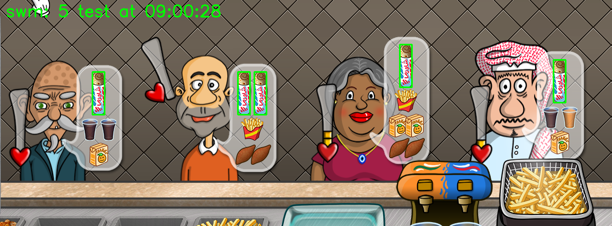

# 半自动沙威玛辅助工具

## 注意：早期刚加入图像识别的版本存在 bug，截图无反应、不报错，现已修复，请使用最新版本。

Python 开发的快捷键实现自动鼠标控制沙威玛辅助工具。**有图像识别自动喂食客人，但喂食哪一位需要自己按快捷键**

图像识别功能：

- 识别客人气泡，判断需要喂哪些东西
- 识别桌子上的沙威玛，自动拿取。不会凭空点击桌子上的错误位置。
- 识别桌子右侧的薯条位置。

**由于此脚本配置复杂，且如果游戏进度没有到“除了自定配料、拆除墙壁外都解锁了”的进度， 就需要自行编写合适的脚本操作并绑定快捷键**
（比如现在脚本不会自己去点可乐机的按钮），且非 1920x1080 的屏幕需要重新配置坐标点，**故做不到开箱即用**


## 1. 快速开始

### 1.1 配置 python 环境，安装依赖库。

依赖库：

- `pyperclip` 用于快速复制当前鼠标坐标
- `win32api, win32con` 模拟鼠标操作
- `pynput` 监听键盘，绑定快捷键
- `mss` 屏幕截图
- `opencv-python` 图像识别
- `rich` 彩色控制台输出

安装方法： `pip install pyperclip pywin32 pynput mss opencv-python rich`

运行方法：在项目目录下，打开终端，运行 `python main.py`

按下 Esc 键退出，如需临时切出游戏画面，可按 Windows 键。

### 1.2 检查分辨率

如果你的显示器是 1920x1080 分辨率，并且现在顾客是 4 个，那全屏运行游戏，看看按下 q、w、a、1、2、3、4 键是否能正常工作。
能的话，后面不用看了，这就是脚本的所有功能。

按下 q、w、a 鼠标应当能够正确移动到目标位置，拖动操作、点击均正常。

1、2、3、4 键应当能够正确识别客人的气泡，弹出的三个窗口中有正确识别客人需求，画框位置准确。


### 1.3 上述不满足/出现问题

**显示器不是 1920x1080**：需要重新配置坐标点，见下方 `2.1 坐标点`

**点击位置不对**：需要运行脚本，用快捷键 p 复制鼠标的坐标，并配置坐标点，见下方 `2.1 坐标点`

**鼠标点击了，位置正确，但游戏不响应**，见下方 `2.3 鼠标操作和延迟`

**弹出的三个窗口上，有没有正确画框**（识别）并自动投喂: 见下方 `2.2 图像识别`

**客人数量不是4个**，见结尾部分`3.3 自行定制开发` 和 `例：添加第五位客人的识别`。

## 2 配置

> tips: 你可以编辑 `main.py` 中399到401行的内容，来修改按下什么按键可以让脚本退出：

```python
# main.py

async def handle_key_press(key):
    # 这一行表示按下 esc 键退出
    if key in {keyboard.Key.esc}:
    # 你可以自己添加其他按键，比如按下 ESC 或 f1 键退出
    if key in {keyboard.Key.esc, keyboard.Key.f1}:
```

**只要配置好了坐标点，就可以运行不需要视觉识别的部分了**（如一键添加4个菜制作沙威玛）。

---

启动脚本后，会弹出三个灰色窗口，分别是截取客人气泡、截取桌子上的沙威玛、截取桌子右侧的薯条。
这三个窗口是用来调试图像识别的，不影响脚本的运行。可以实时观看识别效果。

> 注意只有按了快捷键后才会识别，不会一直识别。薯条也是只有发现客人要薯条，才会去桌子右侧识别

根目录 `config.py` 内有部分杂项配置（就两条），此文件被导入 `main.py` 内。如果你的沙威玛进度接近满级，这个可以不用管。

在 `sha` 目录下：

- `__init__.py`：实现鼠标控制的抽象层。在这里可以微调鼠标的移动延迟，下文有说。
- `points.py`：配置坐标点，内部包含详细注释。
- `cv.py`：实现图像识别功能，内部指定了读取哪些png文件。

### 2.1 🔨坐标点(sha/points.py)

坐标点在 `sha/points.py` 内配置，对应文件内有详细注释。可以使用快捷键 p 复制当前鼠标坐标，然后粘贴到对应的位置。

配置好坐标后，以下功能可以使用：
- 一键添加四个菜并卷饼，制备沙威玛（快捷键 q）
- 一键点击炸土豆，把炸好的土豆放到盘子上（快捷键 w，解锁了自动炸土豆则无需此步骤）
- 一键进货（快捷键 a）

### 2.2 🖼️图像识别(sha/cv.py)

> test/ 文件夹下的图片是用来测试的，在我的环境下，这几张图片是能被正确识别的。你可以看下方说明，拉取项目后，立即运行 `python test.py` 测试图像匹配。这一步能够确保图片截取都是正确的。
> 
> 也可以备份这些图片后，替换成自己的图片，测试图像匹配在自己的屏幕截图下是否正确工作。**如果没有修改 test 下的图片，且这部分测试无法正确画框，那就是出 bug 了，我还没有复现这种情况**
> 
> 你也可以自行修改 test.py 内的代码，来测试不同的图像识别逻辑。核心就是测试 `cv.match_many_object_on_image` 函数。

图像识别在 `sha/cv.py` 内。推荐先运行脚本，按下快捷键 1、2、3、4（不是小键盘上的）喂食客人
（等着客人来了并且出现气泡），看看是否正常识别。


**如果窗口范围不正确**：重新改 `sha/points.py` 内的坐标点，确保截取的区域完全包含客人气泡即可。

**如果范围正确，但不识别、不画框**：运行 `python test.py`，然后进入 `test` 文件夹，查看所有以 `__test` 名字开头的图片，看看是否有正确画框。

如果这些图片上没有绿色框框，说明视觉识别模块出现问题，我没有复现，也不清楚具体出在哪里，可能需要自行 debug。



如果正确画框了（类似上图），只是游戏内不识别，那么问题好解决，按下面的列表逐一尝试即可。
1. `sha.points.py` 内的截图坐标点不对，左上角和右下角形成的区域，要把客人的气泡完整覆盖。**每位客人都要按照最大的气泡范围截图，比如按照上图中右侧第2位的气泡大小，预估其他人的气泡范围**
2. 自己重新截图，覆盖 `img` 目录下的那几张小图片（下面列出了图片的含义）。截取范围尽量小，不要包括物品外面的东西，不要产生任何图片缩放。选取物品最有特征的部分（比如沙威玛的包装+一部分上面卷饼的范围）如果不好截图，也可以截取全屏后，用画图工具裁剪。
3. 如果上面两步还不行……并且确认图片没有经过缩放……那我也不知道了…… 

---

所有图片的含义：
- **注意脚本工作的时候，用的图片是 img/ 下的，不是 test/ 下的**
- `shutiao_l.png` 是桌子右侧的三个薯条，不是客人气泡，截取一个即可。
- `swm_h.png` 是桌子上的沙威玛，不是客人气泡。
- 下面的都是客人气泡里的
- `shutiao.png` 客人气泡里要的薯条。
- `swm.png` 是客人气泡里要的沙威玛。
- `box.png` 是客人气泡里面的盒装饮料，不是左下角的。
- `digua.png` 是客人气泡里面的地瓜。截取地瓜的时候不好弄，整个截取会因为重叠，导致只识别一个。目前的方法是截取地瓜的一个角，或者中心部分+一点点外面的轮廓。
- `cola_b.png` 是客人气泡里面的黑色(black)可乐，不是右下可乐机的。
- `cola_o.png` 是客人气泡里面的橙色(orange)汽水，不是右下可乐机的。

---

目前图像识别主要在自动投喂方面使用，自动投喂的工作流程是：
1. 根据按下的快捷键截取屏幕对应部分
2. 循环匹配每一个物品，每一轮循环匹配一个物品多次。如果匹配到了就说明当前客户需要这个物品。
3. 根据匹配生成一个字典，字典的键是客户需要的物品，字典的值是物品数量。
4. 根据字典，依次投喂。
5. 对于沙维玛卷饼和右侧的薯条，它们的起点位置也会通过视觉识别来找出，防止对着空气拖动。
6. 如果发现客户需要两杯可乐或者两杯橙汁，那么会首先投喂一次可乐，继续投喂剩余的需求，最后再投喂一次可乐。这是为了给可乐机器反应的时间。


`sha/cv.py` 中的 `to_show_image` 是一个队列，用来实时显示脚本截图的，与逻辑无关。
核心函数是 `match_many_object_on_image`，用于在一张图片上匹配一个目标多次（比如匹配到客人要2个沙威玛），
匹配所有的客人需求需要循环匹配多轮。


### 2.3 🖱️鼠标操作和延迟(sha/__init__.py)

`sha/__init__.py` 中有不少 `async def` 的异步函数，这些是早期实验用的，可以不用管，现在没用。

主要关心 `click` 和 `swipe` 函数，这两个函数是用来模拟鼠标点击和滑动的。

比如 swipe 的开头为：

```python
def swipe(pos1: Tuple[int, int], pos2: Tuple[int, int], drag_mode: int = DRAG_MODE_FAST) -> None:
    move_to(pos1)
    # 移动到目标点（起点）后延迟
    sleep(.1)
    win32api.mouse_event(
        win32con.MOUSEEVENTF_LEFTDOWN, 0, 0, 0, 0)
    # 按下后延迟
    sleep(.1)
    if drag_mode == DRAG_MODE_TELEPORT:
        move_to(pos2)
        # 移动到目标点（终点）后延迟
        sleep(.03)
        win32api.mouse_event(
            win32con.MOUSEEVENTF_LEFTUP, 0, 0, 0, 0)
        return
```

这里有很多 sleep，是因为**太快的话，游戏内的鼠标只会产生移动，但是拖动操作无效**，你可以微调这几个sleep的时间。

函数的参数内有一个 `drag_mode`，是拖动的模式，有三种：

```python
DRAG_MODE_TELEPORT = 100  # 瞬间移动，不会有拖动效果
DRAG_MODE_FAST = 101      # 快速拖动，会有一个先慢后快的加速效果
DRAG_MODE_SLOW = 102      # 慢速拖动
```


## 3 项目结构

### 3.1 脚本对快捷键的监听(main.py)

此脚本的核心控制方法就是使用快捷键，这部分在 `main.py` 内的第 381 行函数内，用一个巨大的 if 判断实现。

此脚本所有的功能都是从这里判断按下了什么键开始的。

```python
async def handle_key_press(key):
```

在此函数以上的部分，都是写的鼠标操作或视觉识别的逻辑，根据游戏进度，随时调整的，
所以函数看起来很乱。部分函数是游戏早期用的，现在已经不再调用了。

### 3.2 控制函数(main.py)

根据早期进度的习惯，以`action_`开头的函数，可以被视为”用来复用的基础操作”，比如点击一下老板、拖动酱汁放到沙威玛上等。这样的函数被更复杂的组合逻辑调用。
而以`super_`开头的函数，一般是一整套组合流程，
比如添加4个菜、酱汁、卷饼、点打包机，这类函数也会放在下方键盘监听处直接调用。

为了能够让鼠标连点打断当前的操作，做法是**这一类耗时长的组合逻辑会用 main.py 第 18 行声明的线程池 `EXECUTOR` 执行，在提交的函数内部，会频繁检查全局变量 SUPER_CLICK 是否为 True**，
如果为 True，就会立即退出当前函数，这样就可以在按下快捷键时打断当前的操作。

`SUPER_CLICK` 会在按下连点快捷键时被设置为 `True`，然后在松开时被设置为 `False`。

使用线程池 `EXECUTOR = ThreadPoolExecutor(max_workers=1)` 是因为这实现了自动排队的效果，不会因为按下快捷键太快而导致函数重入。

以`__feed`开头的函数，一般是喂食客人用的，如果以`_image_recognition`结尾，就是用图像识别的方式实现的。

### 3.3 自行定制开发

如果你想要添加新的功能，可以在 `main.py` 内添加新的函数，然后在 `handle_key_press` 函数内添加新的快捷键绑定。本质就是，通过快捷键，调用了你自己写的函数。

这些函数很有用：

#### 模拟鼠标点击`sha.click`

`sha.click(POS_BOSS, 2)` 表示在 `POS_BOSS` 处点击两次。

#### 模拟鼠标拖动`sha.swipe`

`sha.swipe(POS_CAKE_BOTTOM, POS_CAKE_TOP, sha.DRAG_MODE_SLOW)` 表示从 `POS_CAKE_BOTTOM` 拖动到 `POS_CAKE_TOP`，拖动速度慢。

#### 移动鼠标到某个位置`sha.move_to`

`sha.move_to(POS_BOSS)` 表示移动鼠标到 POS_BOSS 处。


#### 截图`cv.fast_screen_shot`

可指定左上、右下坐标

`cv.fast_screen_shot(POS_TABLE_LT, POS_TABLE_RB)` 表示截取 `POS_TABLE_LT` 和 `POS_TABLE_RB` 之间的区域。

这个函数会返回一个 `np.ndarray` 类型的图片，可以直接传给图像识别函数。

#### 图像识别`cv.match_many_object_on_image`

```python
# sha/cv.py

def match_many_object_on_image(whole_img: np.ndarray,
                               obj_img: np.ndarray,
                               threshold=0.8,
                               draw_rect=False,
                               save_file=False,
                               output_name='output.png') -> List[Tuple[int, int]]:
    """
    在整张图片上找到所有的目标物体
    :param whole_img: 整张图片
    :param obj_img: 目标物体
    :param threshold: 阈值
    :param draw_rect: 是否画出矩形
    :param save_file: 是否保存到文件
    :param output_name: 输出文件名
    :return: 所有目标物体的中心坐标
    """
    ...

# 用法    
img = cv.fast_screen_shot(POS_TABLE_LT, POS_TABLE_RB)
res = cv.match_many_object_on_image(img,
                              cv.img_swm_h,
                              draw_rect=True,
                              save_file=True,
                              output_name='swm_h.png')

# res 就存储了所有识别到的沙威玛的中心坐标
# 类似 [(x1, y1), (x2, y2), ...] 
```

- img：要识别的图片，可以是 fast_screen_shot 返回的，也可以是 cv.imread 读取的，但不能是图片路径
- cv.img_swm_h：模板，也就是查找什么元素。类型同上。这里的 img_swm_h 是已经 imread 过的图片
- draw_rect：是否在识别到的地方画框
- save_file：是否保存到文件
- output_name：保存此图片的名称，无论去什么名字，都会存在 test 目录下

## 4 例子

### 例：添加第五位客人的识别

目前脚本识别的是4位客人，如果要添加第5位客人的识别，可以这样做：

更新坐标点。运行脚本，打开游戏，需要采集的点是：五位客人的中心坐标、五个客人气泡的左上角坐标、五个客人气泡的右下角坐标。更新到 `sha/points.py` 内。

你可以仿照脚本里的写法，加入类似这样的：

```python
# sha/points.py

POS_GUEST_5 = (xxx, xxx)

POS_GUEST_5_LT = (xxx, xxx)
POS_GUEST_5_RB = (xxx, xxx)
```

> 如果前面的客人位置也改变了，那么同理需要修改 sha/points.py 内其他客人的坐标。

喂食用了一个函数 `feed_guest_image_recognition`，我们将在快捷键部分调用这个函数。

> 还有一个 `__feed_guest_image_recognition` 函数，这是最终会被放到线程池上执行的回调函数，内部实现了喂食的具体逻辑，目前我们无需直接与它打交道。

上述函数接受三个参数：**(客人气泡左上角点, 客人气泡右下角点, 客人中心点)** 传错顺序会导致图像识别不工作，且没有报错信息。


接着绑定快捷键，修改 `main.py` 内的 `handle_key_press` 函数，添加一个新的 if 分支，比如：

```python
# main.py 369
# 原有
async def handle_key_press(key):
    # ...
    try:
        if key.char == 'p':
            ...
        # 原有
        elif key.char == '4':
            # feed_guest(POS_GUEST_4)
            feed_guest_image_recognition(POS_GUEST_4_LT, POS_GUEST_4_RB, POS_GUEST_4)

        # 追加
        elif key.char == '5':
			feed_guest_image_recognition(POS_GUEST_5_LT, POS_GUEST_5_RB, POS_GUEST_5)
    # ...
```

现在去游戏内，按下 5 键，应该可以识别第五位客人的需求，并自动喂食了。

