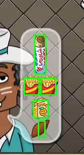

# 半自动沙威玛辅助工具

Python 开发的快捷键实现自动鼠标控制沙威玛辅助工具。**有图像识别自动喂食客人，但喂食哪一位需要自己按快捷键**

图像识别功能：

- 识别客人气泡，判断需要喂哪些东西
- 识别桌子上的沙威玛，自动拿取。不会凭空点击桌子上的错误位置。
- 识别桌子右侧的薯条位置。

**由于此脚本配置复杂，且如果游戏进度没有到“除了自定配料、拆除墙壁外都解锁了”的进度， 就需要自行编写合适的脚本操作并绑定快捷键**（比如现在脚本不会自己去点可乐机的按钮），且非 1920x1080 的屏幕需要重新配置坐标点，**故做不到开箱即用**

## 1 配置并运行


自行使用此程序的流程：

1. 配置 python 环境，安装依赖库。
2. 如果你的显示器是 1920x1080 分辨率，并且现在顾客是 4 个，那全屏运行游戏，看看按下 q、w、a、1、2、3、4 键是否能正常工作。能的话，恭喜后面不用看了，这就是脚本的所有功能。
3. 不行的话，或者顾客是3、5个，需要运行脚本，用快捷键 p 复制鼠标的坐标，并配置坐标点，见下方 1.1。
4. 配置好后，再次运行脚本，不依赖视觉识别的部分应当能正常工作。再按快捷键 q、w、a、1、2、3、4 看能否正确识别客人的气泡，看弹出的三个窗口上有没有正确画框（识别）并自动投喂。
5. 如果能，恭喜，可以开始使用了。后面不用看
6. 如果不能，需要自行截图，替换 `img/` 目录下的图片。见下面的 1.2 部分

入口文件为 `main.py`。

依赖库：

- `pyperclip` 用于快速复制当前鼠标坐标
- `win32api, win32con` 模拟鼠标操作
- `pynput` 监听键盘，绑定快捷键
- `mss` 屏幕截图
- `opencv-python` 图像识别
- `rich` 彩色控制台输出

> tips: 你可以编辑 `main.py` 中399到401行的内容，来修改按下什么按键可以让脚本退出：

```python
# main.py

async def handle_key_press(key):
    # 这一行表示按下 esc 键退出
    if key in {keyboard.Key.esc}:
    # 你可以自己添加其他按键，比如按下 ESC 或 f1 键退出
    if key in {keyboard.Key.esc, keyboard.Key.f1}:
```

**只要配置好了坐标点，就可以运行不需要视觉识别的部分了**（如一键添加4个菜制作沙威玛）。

启动脚本后，会弹出三个灰色窗口，分别是截取客人气泡、截取桌子上的沙威玛、截取桌子右侧的薯条。
这三个窗口是用来调试图像识别的，不影响脚本的运行。可以实时观看识别效果。

> 注意只有按了快捷键后才会识别，不会一直识别。薯条也是只有发现客人要薯条，才会去桌子右侧识别

根目录 `config.py` 内有部分杂项配置（就两条），此文件被导入 `main.py` 内。如果你的沙威玛进度接近满级，这个可以不用管。

在 `sha` 目录下：

- `__init__.py`：实现鼠标控制的抽象层。在这里可以微调鼠标的移动延迟，下文有说。
- `points.py`：配置坐标点，内部包含详细注释。
- `cv.py`：实现图像识别功能，内部指定了读取哪些png文件。

### 1.1 坐标点(sha/points.py)

坐标点在 `sha/points.py` 内配置，对应文件内有详细注释。

配置好坐标后，以下功能可以使用：
- 一键添加四个菜并卷饼，制备沙威玛（快捷键 q）
- 一键点击炸土豆，把炸好的土豆放到盘子上（快捷键 w，解锁了自动炸土豆则无需此步骤）
- 一键进货（快捷键 a）

### 1.2 图像识别(sha/cv.py)

图像识别在 `sha/cv.py` 内。推荐先不改这部分，先运行脚本，按下快捷键 1、2、3、4（不是小键盘上的）喂食客人（等着客人来了并且出现气泡），看看是否正常识别。



**如果发现截图正常截取了，但是脚本不识别（正常在那个显示截图的三个窗口里，识别到的物品会画框），可能是屏幕分辨率与我的不同，顾截出来的图片无法匹配**。

推荐等着客人都来了，都冒出气泡后，自行截图，尽量按照 img/ 目录下的样子截取一个很小、很精确的范围，替换 img/ 目录下的图片。如果觉得不好截图，也可以截取全屏，再用画图工具裁剪。

需要哪些元素，看 img 目录下即可，直接替换那些 png 文件。

直接替换文件，不改名，就不需要改代码。如果你想改名，那么需要在 `sha/cv.py` 内修改对应的读取路径。

有几个文件有点迷惑性：
- `shutiao_l.png` 是桌子右侧的三个薯条，截取一个即可。
- `swm_h.png` 是桌子上的沙威玛。
- 下面的都是客人气泡里的
- `shutiao.png` 客人气泡里要的薯条。
- `swm.png` 是客人气泡里要的沙威玛。
- `box.png` 是客人气泡里面的盒装饮料，不是左下角的。
- `digua.png` 是客人气泡里面的地瓜。截取地瓜的时候不好弄，整个截取会因为重叠，导致只识别一个。目前的方法是截取地瓜的一个角。
- `cola_b.png` 是客人气泡里面的黑色(black)可乐，不是左下角的。
- `cola_o.png` 是客人气泡里面的橙色(orange)汽水，不是左下角的。
- 截图尽量选择无遮挡的部分，截取区域小一点。可以参考 img 目录下的图片。

**只要能在截图内匹配出上面几个图片，此脚本全部功能就都可使用**

`sha/cv.py` 中的 `to_show_image` 是一个队列，用来实时显示脚本截图的，与逻辑无关。
核心函数是 `match_many_object_on_image`，用于在一张图片上匹配一个目标多次（比如匹配到客人要2个沙威玛），
匹配所有的客人需求需要循环匹配多轮。


### 1.3 鼠标操作和延迟(sha/__init__.py)

`sha/__init__.py` 中有不少 `async def` 的异步函数，这些是早期实验用的，可以不用管，现在没用。

主要关心 `click` 和 `swipe` 函数，这两个函数是用来模拟鼠标点击和滑动的。

比如 swipe 的开头为：

```python
def swipe(pos1: Tuple[int, int], pos2: Tuple[int, int], drag_mode: int = DRAG_MODE_FAST) -> None:
    move_to(pos1)
    # 移动到目标点（起点）后延迟
    sleep(.1)
    win32api.mouse_event(
        win32con.MOUSEEVENTF_LEFTDOWN, 0, 0, 0, 0)
    # 按下后延迟
    sleep(.1)
    if drag_mode == DRAG_MODE_TELEPORT:
        move_to(pos2)
        # 移动到目标点（终点）后延迟
        sleep(.03)
        win32api.mouse_event(
            win32con.MOUSEEVENTF_LEFTUP, 0, 0, 0, 0)
        return
```

这里有很多 sleep，是因为**太快的话，游戏内的鼠标只会产生移动，但是拖动操作无效**，你可以微调这几个sleep的时间。

这个近函数的参数内有一个 `drag_mode`，是拖动的模式，有三种：

```python
DRAG_MODE_TELEPORT = 100  # 瞬间移动，不会有拖动效果
DRAG_MODE_FAST = 101      # 快速拖动，会有一个先慢后快的加速效果
DRAG_MODE_SLOW = 102      # 慢速拖动
```


## 2 项目结构

### 2.1 脚本对快捷键的监听(main.py)

此脚本的核心控制方法就是使用快捷键，这部分在 `main.py` 内的第 381 行函数内，用一个巨大的 if 判断实现。

此脚本所有的功能都是从这里判断按下了什么键开始的。

```python
async def handle_key_press(key):
```

在此函数以上的部分，都是写的鼠标操作或视觉识别的逻辑，根据游戏进度，随时调整的，
所以函数看起来很乱。部分函数是游戏早期用的，现在已经不再调用了。

### 2.2 控制函数(main.py)

根据早期进度的习惯，以`action_`开头的函数，可以被视为一个组合操作，比如单独拖动酱汁放到沙威玛上。这样的函数被更复杂的组合逻辑调用。
而以`super_`开头的函数，一般是一整套组合流程，
比如添加4个菜、酱汁、卷饼、点打包机，这类函数也会放在下方键盘监听处直接调用。

而为了能够让鼠标连点打断当前的操作，做法是**这一类耗时长的组合逻辑会用 main.py 第 18 行声明的一个只有一个 worker 的线程池 `EXECUTOR` 执行，在提交的函数内部，会频繁检查全局变量 SUPER_CLICK 是否为 True**，
如果为 True，就会立即退出当前函数，这样就可以在按下快捷键时打断当前的操作。

使用线程池 `EXECUTOR = ThreadPoolExecutor(max_workers=1)` 是因为这实现了自动排队的效果，不会因为按下快捷键太快而导致函数重入。

`SUPER_CLICK` 会在按下连点快捷键时被设置为 `True`，然后在松开时被设置为 `False`。


以`__feed`开头的函数，一般是喂食客人用的，如果以`_image_recognition`结尾，就是用图像识别的方式实现的（自动找桌子上有哪些可用的）。

### 2.3 自行定制开发

如果你想要添加新的功能，可以在 `main.py` 内添加新的函数，然后在 `handle_key_press` 函数内添加新的快捷键绑定。本质就是，通过快捷键，调用了你自己写的函数。

这些函数很有用：

#### 模拟鼠标点击`sha.click`

`sha.click(POS_BOSS, 2)` 表示在 POS_BOSS 处点击两次。

#### 模拟鼠标拖动`sha.swipe`

`sha.swipe(POS_CAKE_BOTTOM, POS_CAKE_TOP, sha.DRAG_MODE_SLOW)` 表示从 POS_CAKE_BOTTOM 拖动到 POS_CAKE_TOP，拖动速度慢。

#### 移动鼠标到某个位置`sha.move_to`

`sha.move_to(POS_BOSS)` 表示移动鼠标到 POS_BOSS 处。


#### 截图`cv.fast_screen_shot`

可指定左上、右下坐标

`cv.fast_screen_shot(POS_TABLE_LT, POS_TABLE_RB)` 表示截取 POS_TABLE_LT 和 POS_TABLE_RB 之间的区域。

#### 图像识别`cv.match_many_object_on_image`

```python
# sha/cv.py

def match_many_object_on_image(whole_img: np.ndarray,
                               obj_img: np.ndarray,
                               threshold=0.8,
                               draw_rect=False,
                               save_file=False,
                               output_name='output.png') -> List[Tuple[int, int]]:
    """
    在整张图片上找到所有的目标物体
    :param whole_img: 整张图片
    :param obj_img: 目标物体
    :param threshold: 阈值
    :param draw_rect: 是否画出矩形
    :param save_file: 是否保存到文件
    :param output_name: 输出文件名
    :return: 所有目标物体的中心坐标
    """
    ...

# 用法    
cv.match_many_object_on_image(img,
                              cv.img_swm_h,
                              draw_rect=True,
                              output_name='swm_h.png')
```

- img：要识别的图片，可以是 fast_screen_shot 返回的，也可以是 cv.imread 读取的，但不能是图片路径
- cv.img_swm_h：模板，也就是查找什么元素。类型同上。这里的 img_swm_h 是已经 imread 过的图片
- draw_rect：是否在识别到的地方画框
- output_name：保存此图片的名称，无论去什么名字，都会存在 test 目录下

#### 例：添加第五位客人的识别

目前脚本识别的是4位客人，如果要添加第五位客人的识别，可以这样做：

更新坐标点。运行脚本，打开游戏，需要采集的点是：五位客人的中心坐标、五个客人气泡的左上角坐标、五个客人气泡的右下角坐标。更新到 `sha/points.py` 内。

你可以仿照脚本里的写法，加入类似这样的：

```python
# sha/points.py

POS_GUEST_5 = (xxx, xxx)

POS_GUEST_5_LT = (xxx, xxx)
POS_GUEST_5_RB = (xxx, xxx)
```

此脚本喂食用了一个函数 `__feed_guest_image_recognition`，可以在 `main.py` 内找到。你需要更新这个函数如何将客人索引 5 转换为客人的中点坐标：

```python
# main.py

def __feed_guest_image_recognition(guest_index: int) -> None:
    print(f'=' * 20)
    print(f'开始识别 {guest_index} 的需求')

    # ...

    elif guest_index == 4:
        pos_lt = POS_GUEST_4_LT
        pos_rb = POS_GUEST_4_RB
        pos_g = POS_GUEST_4
    # ...
    
    # 追加
    elif guest_index == 5:
        pos_lt = POS_GUEST_5_LT
        pos_rb = POS_GUEST_5_RB
        pos_g = POS_GUEST_5
```

接着绑定快捷键，修改 `main.py` 内的 `handle_key_press` 函数，添加一个新的 if 判断，比如：

```python
# main.py 369

async def handle_key_press(key):
    if key in {keyboard.Key.esc}:
        # Stop listener
        return False
    try:
        if key.char == 'p':
            ...

        # 追加
        elif key.char == '5':
            feed_guest_image_recognition(5)
```

现在去游戏内，按下 5 键，应该可以识别第五位客人的需求，并自动喂食了。